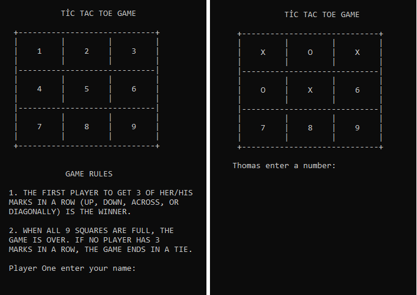

# Project 2 - Ruby : Tic Tac Toe with RSpec

## Screen Shot

In this project, we applied RSpec tests on the methods of our tic-tac-toe game in the following components:

1. Player class methods
2. Public.rb file methods
3. Game class methods

## Built With

- Ruby
- RSpec
- Rubocop
- VSCode
- Atom

## Getting Started

Follow these steps to get a local copy up and running :

1. Install `git` on your local machine.
2. Type `git init` in the Terminal.
3. Clone the repository to your local machine `https://github.com/Rayan84/tic-tac-toe.git`.
4. Cd into the repository `cd tic-tac-toe`.
5. In the bash terminal enter `rspec`

## Authors

## Omar Rashad

* GitHub: [ @od-c0d3r](https://github.com/od-c0d3r)
* Twitter:[ @od_coder](https://twitter.com/od_coder)
* LinkedIn:[ @omarrashad](https://www.linkedin.com/in/omarrashad/)

## Rayan Rassam
* Github:[ @Rayan84](https://github.com/Rayan84)
* Twitter:[ @Rayan65096267](https://twitter.com/Rayan65096267)
* LinkedIn:[ @rayan rassam](https://www.linkedin.com/in/rayan-rassam-18a0a426/)

## Contributing

Contributions, issues, and feature requests are welcome!

## Show your support

Give a star if you like this project!